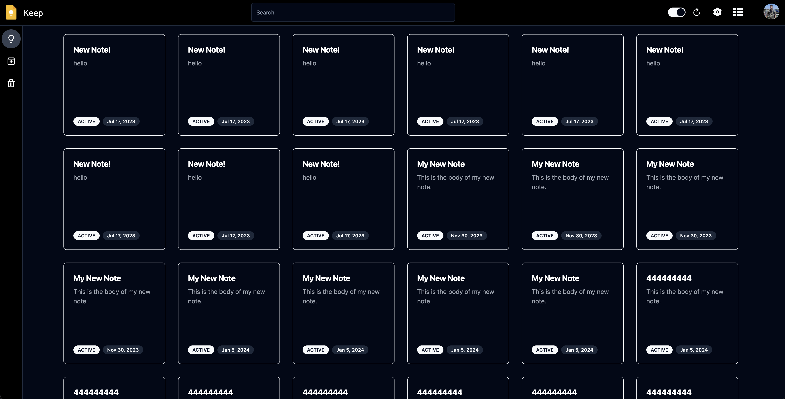

# keep-clone   

## Description
Purpose of this project is to create a clone of the [Google Keep](https://keep.google.com) notes app using the following technology
- [ReactJS](https://reactjs.org/)
- [Vite](https://vitejs.dev/)
- [GraphQL](https://graphql.org/)
- [Golang](https://golang.org/)
- [MongoDB](https://www.mongodb.com/)
- [Docker](https://www.docker.com/)
- [Tailwind](https://tailwindcss.com/)
- [Shadcn/ui](https://ui.shadcn.com/)
- [Terraform](https://www.terraform.io/)
- [AWS](https://aws.amazon.com/)

## Staging Deployment
- [UI](https://staging.budnick.io/)

---

### Disclaimer
*This project is not affiliated with Google in any way. It is simply a clone of the Google Keep notes app, which is being used for educational purposes only.*